# Happy

App criado na Next Level Week #03.

Utilizando: 

 * React.Js para o Front-End da versão Web;
 * Node.Js para o Back-End;
 * SQLite para o Banco de Dados;
 * React Native para a versão Mobile.

Mais informações após a Next Level Week acabar

## Web

---

### Tela Inicial

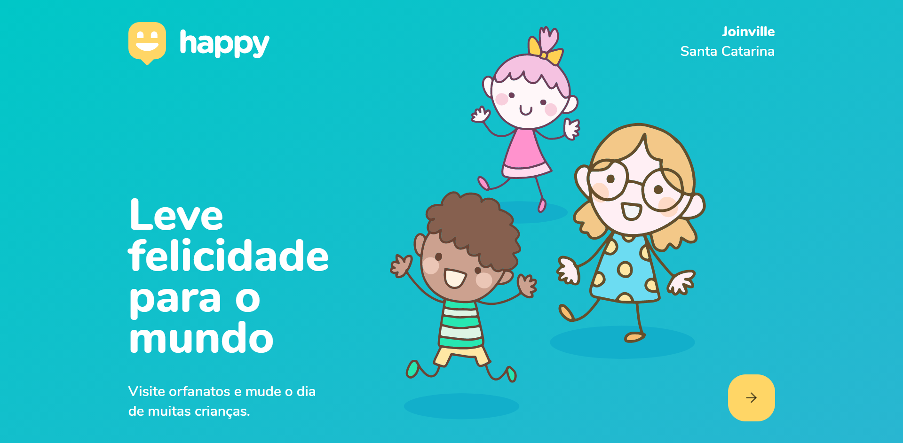

---

### Tela dos Orfanatos

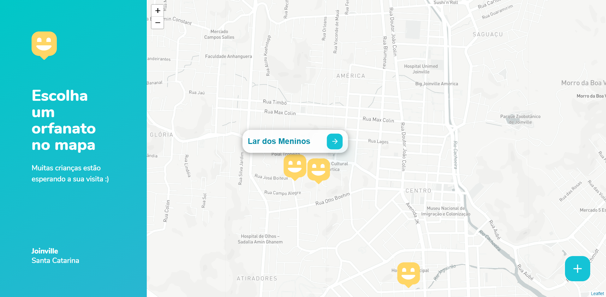

---

### Tela de informações

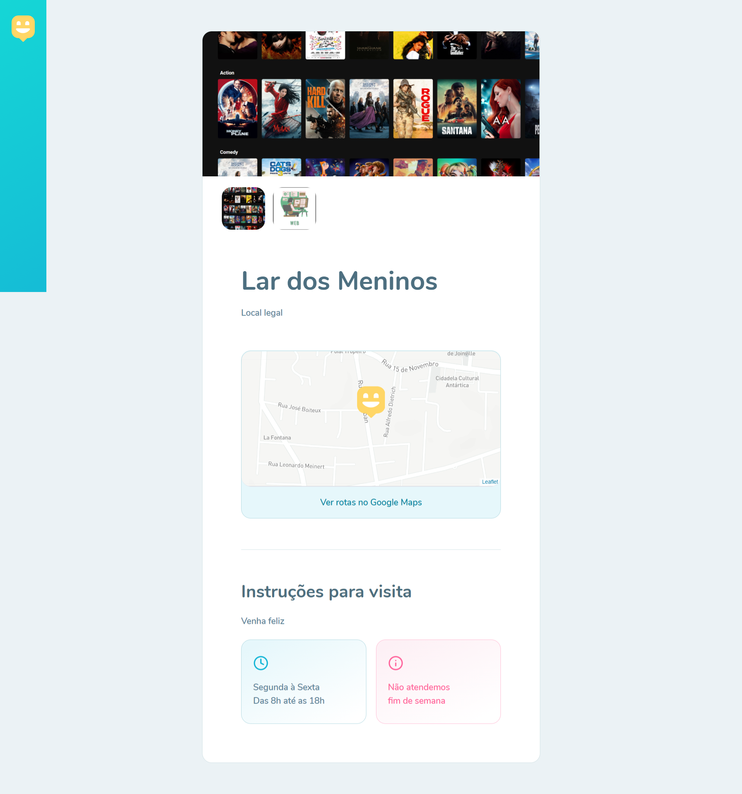

---

### Tela de cadastro de Orfanato

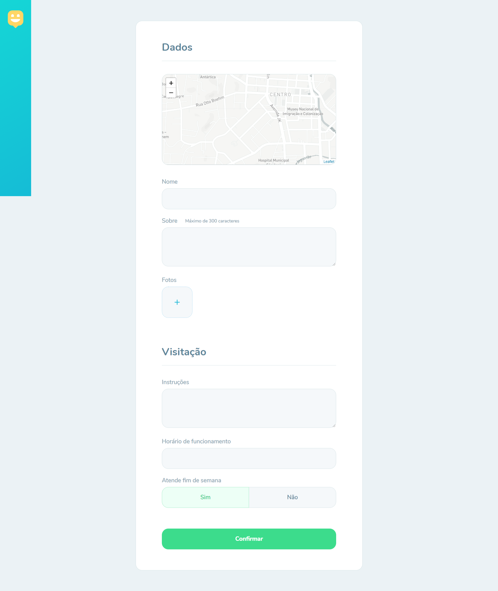

---

### Banco de Dados SQLite

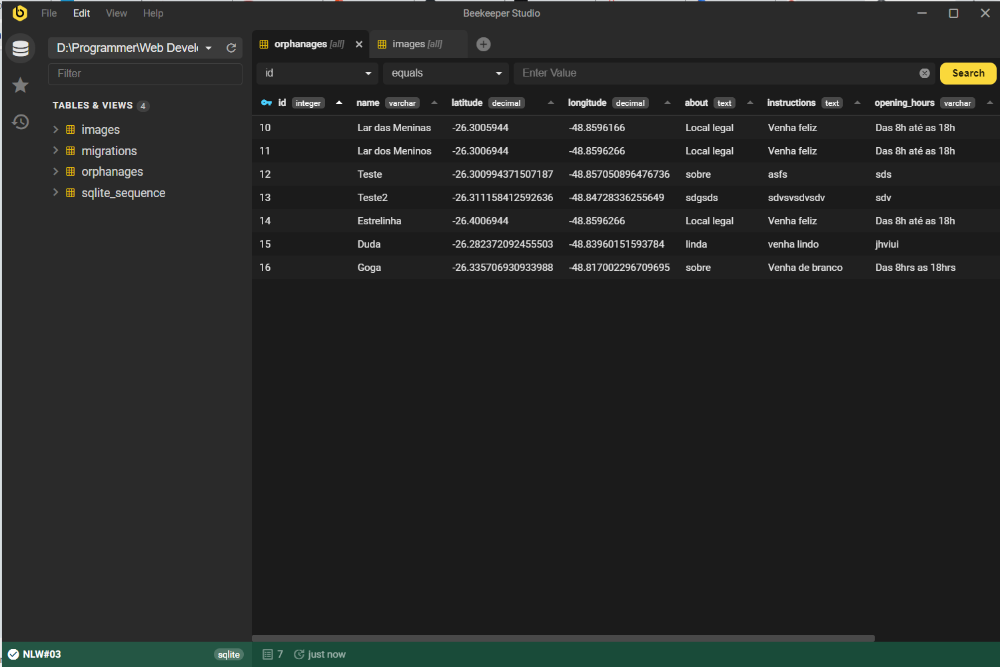

---

## Mobile

---

### Tela Inicial

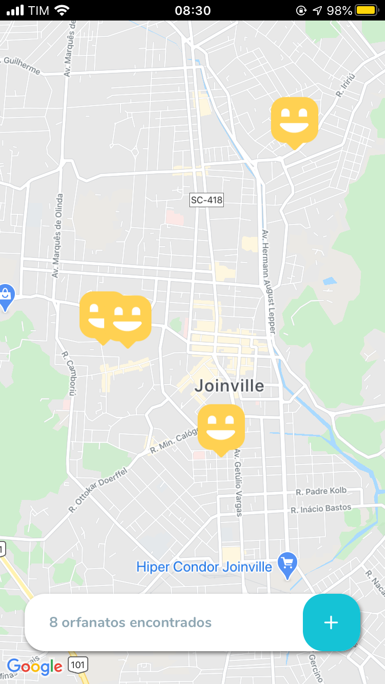

---

### Tela de Detalhes

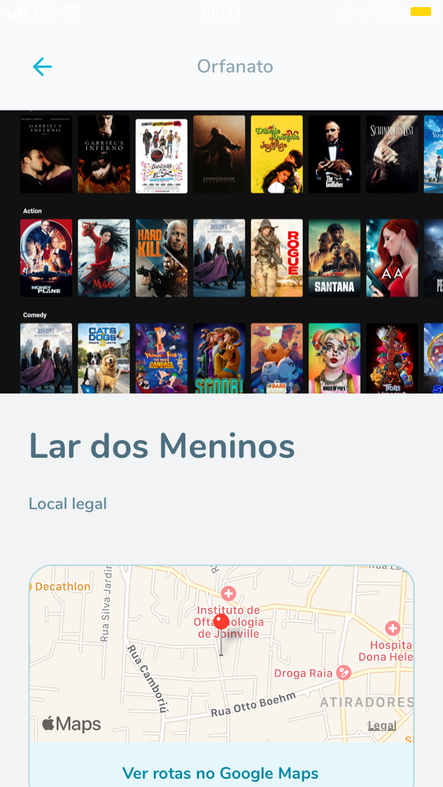
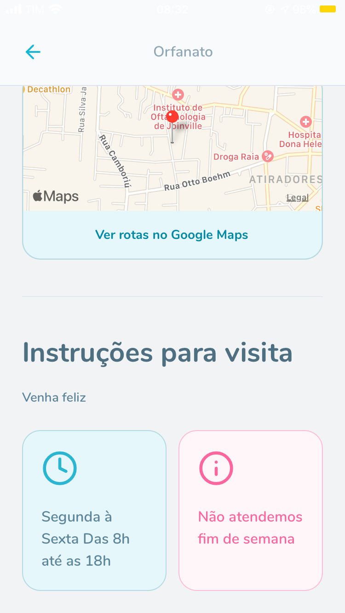

---

### Selecione no Mapa

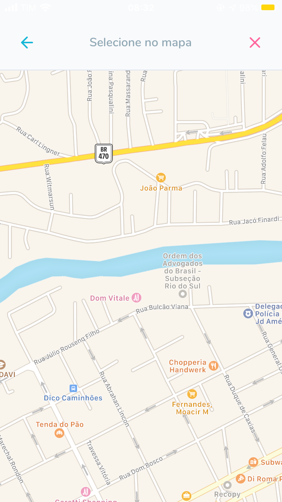

---

### Criar Orfanato

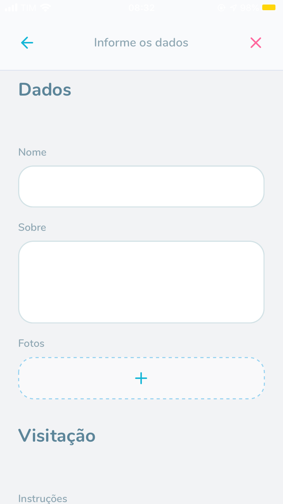
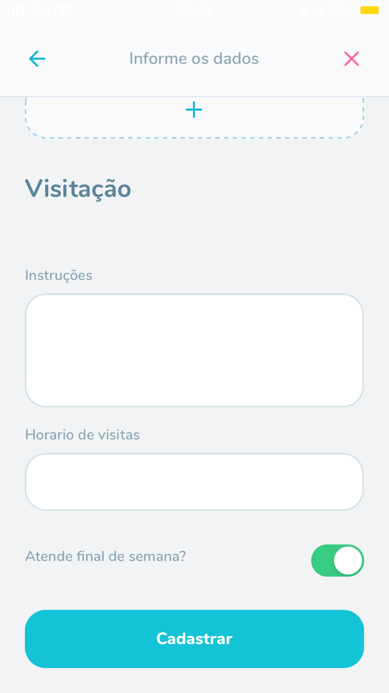
